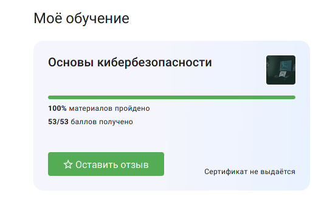
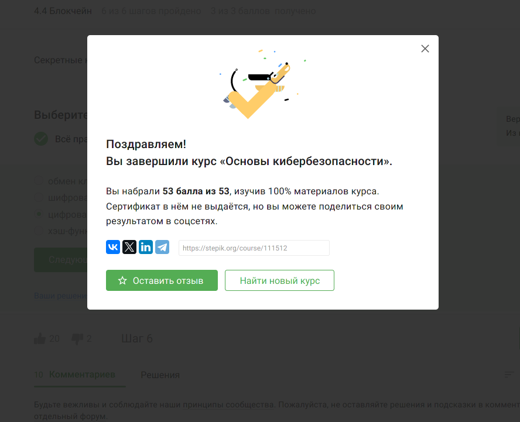

# Введение

В современном цифровом мире, где информация играет ключевую роль в различных сферах жизни, вопросы кибербезопасности становятся все более актуальными. Каждый день миллионы людей и компаний сталкиваются с угрозами в сети, связанными с хакерскими атаками, кражей личных данных, вирусами и многими другими видами киберугроз. 

Курс "Основы кибербезопасности" призван предоставить студентам фундаментальные знания и навыки, необходимые для защиты информации и обеспечения безопасности в онлайн-среде. В ходе обучения участники курса изучат основные принципы кибербезопасности, методы защиты от киберугроз, технологии шифрования, а также узнают о современных тенденциях и вызовах в области кибербезопасности.

Благодаря уникальному сочетанию теоретических знаний и практических навыков, обучающиеся получат возможность не только понять основы кибербезопасности, но и применить их на практике для защиты своих данных, а также данных компаний и организаций. Курс "Основы кибербезопасности" открывает двери в захватывающий мир киберзащиты и поможет студентам успешно преодолевать вызовы цифровой безопасности.

# Цель работы

Освоить основные принципы и концепции кибербезопасности, овладеть ключевыми навыками для обеспечения защиты информации и данных, улучшить понимание угроз в сети интернет и способов их предотвращения, а также подготовиться к применению полученных знаний в реальных ситуациях для обеспечения безопасности в цифровом пространстве.

# Задание

1. Пройти курс.
2. Выполнить все задания и тесты.
3. Получить сертификат.

# Сертификат

Stepik не выдает сертификат по прохождению данного курса, но видно как я выполнила этот курса на 100%.

